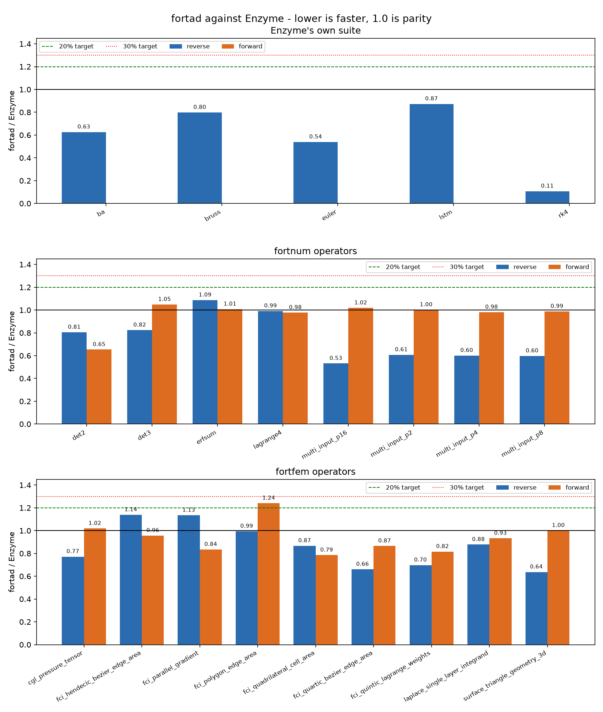
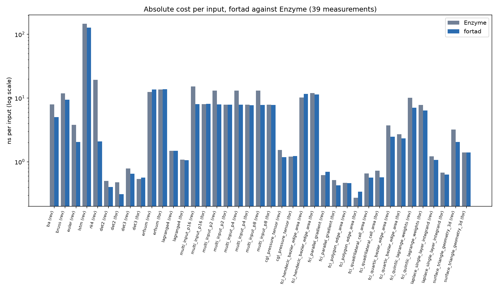

# fortad-bench

Correctness and performance corpus for
**[fortad](https://github.com/lazy-fortran/fortad)**, benchmarked against every
automatic differentiation engine we can build.

fortad's goal is to be **faster than all of them at both build time and runtime,
in every mode**. This repository is where that claim is either demonstrated or
refuted. It holds the workloads, the engine adapters, the measurement harness,
and the committed results.

## Downstream port: fortnum and fortfem against Enzyme

The committed cross-engine corpus covers **59 downstream operators**: 17 from
fortnum and 42 from fortfem. A separate Enzyme-native suite contributes five
additional operators, but is reported separately rather than folded into that
59-operator cross-engine total. The focused vector-Newton follow-up is recorded
separately because the acluster lacks a compatible Enzyme toolchain. It is not
included in a same-machine ratio.





| Suite | Operators | Worst ratio | Faster than Enzyme |
|---|---|---|---|
| Enzyme's own suite | 5 (reverse) | 0.87x lstm | 5 of 5 |
| fortnum | 17 operators | 1.69x adaptive tangent | see caveat below |
| fortfem | 42 operators | 1.63x curved quadrilateral tangent | see caveat below |

Correctness is checked before timing: the harness compares fortad, Enzyme and
fortsym on every kernel and stops on the first disagreement. All three agree
everywhere.

### adaptive_trace_integrand measures the compiler, not the engine

Its tangent is 1.69x Enzyme, the one fortnum measurement outside 30%,
and the reason is not the derivative. fortad emits the minimal form -
one `exp`, shared between the primal and the tangent - and compiles to
68 instructions, compared with 119 for Enzyme. fortad is nevertheless slower.

What differs is vectorisation across iterations. The kernel is one
`exp` call per element, and Enzyme's object comes out of clang while
fortad's comes out of flang. Whatever clang does with a libm call in a
loop, flang does not, and `-fveclib=libmvec` on the flang side does not
change it.

So the number compares two compilers as well as two differentiators. The
corpus keeps it with the compiler context.

### Read rk4 with care

rk4 reverse at 0.11x is the widest margin in the corpus and the least
representative. The kernel is a *linear* ODE, so its four stages collapse to
`state = a*state + b*z(i)` with `a` and `b` loop-invariant. fortad's affine
analysis proves that and reduces the adjoint to two fused multiply-adds per
step with no tape, where Enzyme differentiates the stages as written and
leaves around thirty-five flops per step. Both return the same gradient.

Make the same ODE nonlinear and the margin goes away: fortad then tapes the
state and recomputes all four stages in reverse, exactly as Enzyme does. The
number measures an advantage on affine recurrences, not on Runge-Kutta.

### TBR storage boundary

The Phase 1 to-be-recorded comparison is in
[`results/p21_tbr_fortad.csv`](results/p21_tbr_fortad.csv), with its method and
independent recurrence check in
[`results/p21_tbr_validation.txt`](results/p21_tbr_validation.txt). The
reduction kernels store no per-iteration values after TBR. The 12-step Newton
adjoint stores its two nonlinear states (192 bytes). The nonlinear recurrence
is the boundary case: it retains one carried state per iteration, 8000 bytes
at `n=1000`. The comparison's zero-TBR baseline is deliberately conservative:
it saves every active real loop assignment, including reduction accumulators.

The separate carried-variable linearity saving is recorded in
[`results/p22_linearity_fortad.csv`](results/p22_linearity_fortad.csv), with an
independent directional finite-difference check in
[`results/p22_linearity_validation.txt`](results/p22_linearity_validation.txt).
For the affine RK4 recurrence, linearity removes a counterfactual 8000-byte
state tape at `n=1000`.

### Explicit OpenMP reduction emission

One-level fused positive reduction adjoints now emit `parallel do` with
race-free reduction and data-sharing clauses. The generated `erfsum` forms
compile with gfortran OpenMP and pass independent one-thread/eight-thread
directional finite-difference checks. The scoped result and its boundaries are
recorded in [`results/p27_openmp_fortad.csv`](results/p27_openmp_fortad.csv) and
[`results/p27_openmp_validation.txt`](results/p27_openmp_validation.txt).

### BLAS/LAPACK structured solve rule

The scoped P3.2 result is recorded in
[`results/p32_blas_lapack_fortad.csv`](results/p32_blas_lapack_fortad.csv), with
the generated-code oracle and the Enzyme comparison protocol in
[`results/p32_blas_lapack_validation.txt`](results/p32_blas_lapack_validation.txt).
The `dgesv` rule is generated and linked against real LAPACK/BLAS on the TU Graz
acluster. The Enzyme numbers are the existing Ryzen 9 direct-solve fixture, so
they establish the performance context without being presented as a same
machine or same implementation timing.

### Nonlinear-root implicit rule

P3.3 records the scalar-root IFT oracle and the Enzyme-through-Newton
comparison in [`results/p33_implicit_root_fortad.csv`](results/p33_implicit_root_fortad.csv)
and [`results/p33_implicit_root_validation.txt`](results/p33_implicit_root_validation.txt).
The registry rule differentiates the converged equation and emits no Newton
iteration tape. The Enzyme values come from the existing Ryzen 9 fixture and
are labelled as a cross-record comparison.

### Fixed-point adjoint rule

The P3.4 Christianson two-phase result is recorded in
[`results/p34_fixed_point_fortad.csv`](results/p34_fixed_point_fortad.csv), with
the remote oracle and comparison boundary in
[`results/p34_fixed_point_validation.txt`](results/p34_fixed_point_validation.txt).
The available reference is implicit products versus fresh complete re-solves.
the separate Enzyme Richardson-trace workload is not presented as the same
fixed-point benchmark.

### FFT, quadrature, interpolation, and special-function rules

The P3.5 representative rule table and oracle are recorded in
[`results/p35_library_rules_fortad.csv`](results/p35_library_rules_fortad.csv)
and [`results/p35_library_rules_validation.txt`](results/p35_library_rules_validation.txt).
The existing FFT, fixed-quadrature, and `erf` records provide performance
context. The new multi-call fortad oracle is labelled separately from those
historical cross-engine measurements.

Regenerate with `scripts/build_{enzyme,fortnum,fortfem}_suite.sh`, then
`python3 scripts/plot_vs_enzyme.py`.

## Repository boundary

`fortad` keeps only what a contributor must run on every change: unit tests and
microbenchmarks that finish in seconds. Everything expensive lives here:
multi-engine builds, LLVM and Enzyme plugin toolchains, Julia and Python
environments, large workloads, and scaling sweeps that take hours.

| | [fortad](https://github.com/lazy-fortran/fortad) | fortad-bench |
|---|---|---|
| Tests that gate every commit | yes | no |
| Microbenchmarks (seconds) | yes | no |
| Cross-engine comparison | no | yes |
| Competing engine toolchains | no | yes |
| Large workloads and scaling sweeps | no | yes |
| Committed measurement records | headline numbers only | full records |
| Correctness oracles | yes, in-tree | yes, cross-engine corroboration |

A change to fortad that claims a performance result cites a run recorded here.
A change here never gates a fortad commit.

## What gets measured

Both metrics are recorded for every engine and mode.

**Runtime.** Complete-workload wall clock is primary. Also peak resident memory,
tape or checkpoint bytes, and, for the emitted Fortran, whether the compiler
vectorised the kernel, read from its own vectorisation report.

**Build time.** Wall clock from unmodified sources to a runnable derivative,
split into: toolchain setup (amortised, reported separately), AD transformation,
and compilation. Also generated-code size, and incremental rebuild time after a
one-line change to the primal. An LLVM plugin pass and a cached `.f90` are very
different products here, and the numbers should say so.

**Modes.** forward (JVP) · reverse (VJP) · vector forward · vector reverse ·
forward-over-reverse (HVP) · dense Hessian · sparse-compressed Jacobian ·
sparse-compressed Hessian · higher-order Taylor. A mode an engine does not
support is recorded as unsupported, never as a win by default.

**Scaling.** In active-input count, output count, direction count, and problem
size, because those dimensions are what flip the forward-versus-reverse verdict
and what separate vector mode from repeated scalar mode.

## Engines

Each engine is an adapter under `engines/` that builds a case and reports timings
through the same interface. An engine that cannot build is recorded as absent,
not as a failure of the case.

| Engine | Level | Language | Notes |
|---|---|---|---|
| **fortad** | Fortran AST/IR → Fortran | Fortran | the subject |
| analytical | hand-derived | Fortran | the ceiling, not a competitor |
| finite differences | n/a | Fortran | accuracy floor and independent oracle |
| Enzyme + flang-new | LLVM IR | Fortran | primary runtime target |
| Enzyme + LFortran | LLVM IR | Fortran | |
| Enzyme + Clang | LLVM IR | C++ | for ported C++ cases such as VMEC++ |
| Tapenade | source transformation | Fortran | primary source-level target |
| Clad | Clang AST → C++ | C++ | AST-level comparison point |
| CoDiPack | expression templates | C++ | fastest overloading tape |
| ADOL-C | tape | C++ | reference semantics, sparse drivers |
| Adept | expression templates | C++ | |
| Sacado | templates | C++ | forward-over-reverse |
| JAX | jaxpr → XLA | Python | |
| PyTorch | tape / dynamo | Python | |
| Enzyme.jl | LLVM IR | Julia | |
| Mooncake.jl | typed SSA | Julia | mutation-heavy reverse mode |
| ForwardDiff.jl | overloading | Julia | chunked vector forward |

Copyleft engines (CoDiPack, Clad, ColPack-dependent drivers) are built and run as
**separate processes or separate builds**. Their numbers enter this repository.
their code does not. See [LEGAL.md](LEGAL.md).

## Cases

Each case under `cases/` fixes the mathematics, the inputs, the outputs, and the
validation criteria, then provides one implementation per engine language. The
problem never changes between engines: only the derivative mechanism does.

Planned, in the order fortad's roadmap needs them:

1. **`vmec-jacobian`**: the VMEC++ half-grid Jacobian kernel. We already have
   measured Enzyme forward and reverse numbers for the C++ version. The Fortran
   port written *idiomatically*, rather than in the allocation-free flat-buffer
   form Enzyme requires, is fortad's go/no-go head-to-head.
2. **`heat1d`**: the fixed 1D heat-equation step from
   [differentiable-fortran](https://github.com/lazy-fortran/differentiable-fortran),
   whose contract and protocol this repository inherits rather than reinvents.
3. **`fortnum-kernels`**: kernels from
   [fortnum](https://github.com/lazy-fortran/fortnum) that already carry an
   `analytical` derivative candidate and committed baselines, so the first
   results are three-way comparisons needing no new infrastructure.
4. **`adbench`**: GMM, bundle adjustment, hand tracking, LSTM. The standard
   cross-tool suite Enzyme's own papers report, ported with attribution (MIT).
5. **`solve-heavy`**: a Newton solve and a fixed-point iteration, testing
   implicit differentiation and Christianson's two-phase adjoint against
   engines that differentiate the iterations. No margin has been measured.
6. **`sparse`**: Jacobians and Hessians with exploitable structure.
7. **`scaling`**: synthetic sweeps in input, output, and direction count.

### itpplasma language cases

Runtime-polymorphism cases:

- [runtime `SELECT TYPE` with deferred child bindings](cases/itpplasma/polymorphic_select_type/README.md)
- [`CLASS IS` and `CLASS DEFAULT`](cases/itpplasma/class_is_default/README.md)
- [factory-created polymorphic allocatable](cases/itpplasma/factory_allocatable/README.md)
- [dynamic callback refusal](cases/itpplasma/dynamic_callback_refusal/README.md)
- [`SELECT TYPE` callback replacement](cases/itpplasma/callback_select_type/README.md)
- [abstract deferred binding refusal](cases/itpplasma/abstract_deferred_refusal/README.md)
- [polymorphic ownership refusal](cases/itpplasma/polymorphic_ownership_refusal/README.md)
- [`class(*)` callback-context refusal](cases/itpplasma/callback_context_refusal/README.md)

Positive cases run every supported runtime arm against fixed values and hand
derivatives. The runtime `SELECT TYPE` case measures both JVP and VJP paths for
linear and quadratic deferred child bindings. Its reverse oracle also uses
central differences and the adjoint identity. Refusal cases first validate the
primal arms and central finite differences.
The case pages give formulas and commands. Measurements are in the
[`TYPE IS` record](results/itpplasma_polymorphic_select_type_validation.txt) and
the [`advanced record`](results/itpplasma_polymorphism_advanced_validation.txt).
The [`callback record`](results/itpplasma_callback_boundary_validation.txt)
also proves that an unsupported procedure-pointer call fails by name and leaves
no derivative file.

The advanced OO boundary record
([`itpplasma_oo_boundaries_validation.txt`](results/itpplasma_oo_boundaries_validation.txt))
adds three valid primal oracles: abstract deferred bindings, an allocatable
polymorphic owner with `move_alloc` and finalization, and procedure pointers
with a `class(*)` context. Each checks fixed values and central finite
differences, then records FortAD's nonzero refusal and confirms that no
derivative file is left behind. The separate positive runtime `SELECT TYPE`
case covers the bounded deferred-binding path. These records cover the
remaining ownership and callback boundaries.

Procedure-interface and complex-value boundaries:

- [optional and keyword arguments](cases/itpplasma/optional_keyword/README.md):
  generated optional JVP plus hand/finite-difference oracle on present and
  absent call paths.
- [generic rank selection](cases/itpplasma/generic_dispatch/README.md): the
  scalar and rank-one overloads run and validate independently, while the
  transform records the B9 refusal.
- [complex arithmetic JVP](cases/itpplasma/complex_real_jacobian/README.md):
  positive real-coordinate path covering `conjg`, `cmplx`, `aimag`, and complex
  multiplication.

The paired measurements and refusal diagnostics are in the
[`procedure-interface record`](results/itpplasma_interfaces_validation.txt).
Expected refusals are progress evidence, not performance wins.
The full positive/refusal acceptance matrix is in the
[`itpplasma end-to-end closeout`](ROADMAP.md#itpplasma-end-to-end-closeout).

FortAD also has an in-tree bounded concrete type-bound-call oracle for a
same-file `type(t)` receiver with default implicit `PASS`.
[`test_type_bound_oracle.f90`](https://github.com/lazy-fortran/fortad/blob/253f59d/test/test_type_bound_oracle.f90)
covers JVP, VJP, finite differences, and explicit refusal cases. A timed bench
case for that slice is still open. Active receiver cotangents and runtime
overrides are outside its contract.

## The study corpus

This repository also holds the field survey that fortad's design rests on,
because it belongs next to the engines rather than next to the compiler.

- **[`docs/upstreams.toml`](docs/upstreams.toml)**: 39 third-party AD projects,
  pinned to exact Git commits or marked metadata-only, with licence, the paths
  worth reading, and what we want to learn from each. `scripts/fetch_upstreams.py`
  clones Git entries into a gitignored `upstream/` tree and records each local
  commit, tree, and licence file in the ignored licence inventory.
  Run `scripts/fetch_upstreams.py --audit-pins` for the offline pin and checkout
  audit. It fails on floating refs, wrong commits, dirty trees, or origin
  mismatches without inventing hashes.
- **[Tapenade corpus](docs/tapenade-corpus.md)**: commit `e59864c`, with tree
  `17288bdf`, contains 10,977 tracked files and 2,014 candidate cases. Run
  `scripts/fetch_upstreams.py --corpus tapenade` to fetch, verify, and write the
  gitignored local inventory. The committed
  [`status ledger`](docs/corpora/tapenade-status.csv) is checked by the same
  audit. Sixty-three rows now have executable FortAD evidence, 240 bounded
  pure-Fortran refusal or feature/dependency classifications, and thirty-four
  invalid-upstream closures are independently recorded. Another
  508 rows have no supported
  Fortran input: 506 contain only C, C++, CUDA, or Julia source, and two contain
  no recognized source. Tapenade was not run for those rows. The remaining
  1,169 rows are queued: 1,095 pure-Fortran rows and 74 mixed-language rows.
  The first [set01 support
  cases](cases/tapenade-set01/README.md) link
  their manifest, runner, oracles, and measurements, and record exact upstream
  paths. The companion
  [`bd01--bd03 tranche`](cases/tapenade-set01/tranche-l-bd-ht.md) adds fresh
  Tapenade parser/tangent/adjoint generation checks for nested calls and the
  split boundary, plus independent numerical oracles. The [`lh085`/`lh092`
  tranche](cases/tapenade-set01/tranche-n-lh083-096.md) adds large-expression
  and nested-call support with the same independent gates. The [`lh086` tranche](cases/tapenade-set01/tranche-o-lh086.md)
  adds a bounded Newton-map port with hand JVP/VJP and adjoint checks. The
  [`lh018` tranche](cases/tapenade-set01/tranche-q-lh018.md) adds a same-file
  function-composition case with a closed-form array/scalar JVP/VJP. The
  [`lh007` refusal](cases/tapenade-set01/lh007.md), [`lh009` refusal](cases/tapenade-set01/lh009.md),
  [`lh011` refusal](cases/tapenade-set01/tranche-q-lh011.md), and [`lh015` refusal](cases/tapenade-set01/tranche-lh015.md)
  add independently checked exact-source boundaries. The
  parallel cross-set tranche adds `set01/bd05`, `set02/lh150`, `set03/ht09`,
  `set04/lh110`, `set05/v052`, and `set06/v234`; each has a pinned manifest,
  fresh Tapenade parser/tangent/reverse compilation, and an independent
  hand/finite-difference/adjoint oracle. See the [cross-set case records](cases/tapenade-set02/tranche-a-lh150.md),
  [ht09](cases/tapenade-set03/tranche-p-ht09.md),
  [lh110](cases/tapenade-set04/tranche-a-lh110.md),
  [v052](cases/tapenade-set05/tranche-v052.md), and
  [v234](cases/tapenade-set06/tranche-a-v234.md).
  The shard-3 `set05/v125` and `set05/v137` tranche adds fresh exact-source
  Tapenade parser/forward/reverse generation, strict generated compilation,
  FortAD JVP/VJP ports, and independent hand, finite-difference, and adjoint
  checks. See [its case record](cases/tapenade-set05-shard3-v125-v137/README.md)
  and [validation result](results/tapenade_set05_shard3_v125_v137_validation.txt).
  The shard-0 `set04/lh148` `module1::toto` entry is also promoted with
  exact-source hashes, fresh three-mode Tapenade generation, strict FortAD
  forward/reverse compilation, and an independent product oracle; see its
  [case record](cases/tapenade-set04/lh148/notes.md).
  The next `set05/v054` `f_vector` entry adds a pure assumed-shape array
  function with generic and elemental companions, fresh three-mode Tapenade
  generation, strict FortAD JVP/VJP compilation, and an independent vector
  reciprocal oracle; see its [case record](cases/tapenade-set05/tranche-v054.md).
  The `set05/v060` `M::func(t,u)` entry adds a small standards-clean function
  with exact upstream hashes, fresh three-mode Tapenade generation, strict
  FortAD forward/reverse compilation, and an independent average-function
  hand/finite-difference/adjoint oracle; see its [case record](cases/tapenade-set05/v060_manifest.toml)
  and [validation result](cases/tapenade-set05/v060_result.txt).
  The subsequent `set05/v064` `LIB::mppsum_real(ptab)` entry records the same
  exact-source, fresh-Tapenade, strict FortAD, harness, and independent
  hand/finite-difference/adjoint gates; see its [manifest](cases/tapenade-set05/v064_manifest.toml)
  and [validation result](cases/tapenade-set05/v064_result.txt).
  The next queue-selected pure-Fortran `set05/v065`
  `LIB::mppsum_real2(ptab,cst,str)` entry records the same gates with `ptab`
  active and passive `cst`; its exact ten loop assignments are represented by
  a standards-clean vector value map, not a repaired upstream source. See its
  [manifest](cases/tapenade-set05/v065_manifest.toml) and
  [validation result](cases/tapenade-set05/v065_result.txt).
  The following queue-selected `set05/v066` `RUN::s(mb1,mb2,mb3,mb4)` row is
  recorded as an invalid-upstream closure: its generic `FUNC` interface is
  ambiguous because specific procedures differ only by array extent, and the
  selected procedure also calls it with unmatched 10x50 and 10x70 actuals.
  Exact and stored sources, fresh pinned Tapenade outputs, and FortAD refusal
  diagnostics are measured; no repaired source or derivative oracle is claimed.
  See its [case notes](cases/tapenade-set05/v066_notes.md) and
  [validation result](cases/tapenade-set05/v066_result.txt).
  The following queue-selected `set05/v067` `RUN::s(mb1,mb2,mb3)` row is
  recorded as an expected modern-Fortran refusal: exact and stored sources use
  nonstandard `REAL*8`, so strict F2018 rejects them while legacy mode is only
  a control. Fresh pinned Tapenade products compile in legacy mode but hit the
  same strict boundary; FortAD exact parser extraction passes, while
  forward/reverse refuse the generic call without derivative output. See its
  [case notes](cases/tapenade-set05/v067_notes.md) and
  [validation result](cases/tapenade-set05/v067_result.txt).
  The following queue-selected `set05/v068` `RUN::s(mb1,mb2,mb3)` row is
  recorded as an invalid-upstream closure: its generic `FUNC` calls have no
  matching specific procedure for the `real(wp)` and `REAL*8` actuals. Exact
  and stored sources, fresh pinned Tapenade outputs, and FortAD refusal
  diagnostics are measured under strict and legacy compiler controls; no
  repaired source or numerical derivative claim is made. See its [case notes](cases/tapenade-set05/v068_notes.md)
  and [validation result](cases/tapenade-set05/v068_result.txt).
  The next deterministic queue shard closes four compiler-clean,
  no-missing-dependency rows (`set05/v196`, `set05/v202`, `set06/v220`, and
  `set06/v232`). Tapenade completes all three probes, while FortAD records
  exact refusal or invalid-generated-interface boundaries. Their independent
  oracle checks defined primal behavior only and makes no derivative-support
  claim. See the [shard manifest and result](cases/tapenade-queue-shard-next/README.md).
  The current modern-feature shard then closes `set04/ptr08`, `set04/ptr07`,
  `set06/v243`, and `set05/v180`, covering recursive pointer ownership, pointer
  alias/lifetime cleanup, and optional-rank generic interfaces. Their exact
  Tapenade/FortAD probes and independent primal/source/refusal models are in
  the [modern-feature shard](cases/tapenade-queue-shard-next-modern/README.md).
  The next8 shard closes four compiler-clean, no-missing-dependency rows:
  `set03/cmv07`, `set10/lh234`, `set06/v237`, and `set03/cm30`. Fresh Tapenade
  probes pass; FortAD records explicit global-state, derived-component,
  module-pointer, and pointer-lifetime boundaries, with independent primal or
  refusal oracles. See the [next8 shard manifest and result](cases/tapenade-queue-shard-next8/README.md).
  The next9 shard closes `set06/v290`, `set03/cm33`, `set03/lh056`, and
  `set03/cm26`. Fresh Tapenade probes pass; FortAD records nested-procedure,
  module-state, and pointer-storage boundaries with independent arithmetic and
  ownership oracles. See the [next9 shard manifest and result](cases/tapenade-queue-shard-next9/README.md).
  The next10 through next16 shards add twenty-eight more compiler-clean rows with
  fresh three-mode probes, exact source hashes, and independent behavioral
  contracts. The next13 rows are `set06/v364`, `set04/lh112`, `set03/lh051`,
  and `set03/cm25`; the next14 rows are `set04/v004`, `set07/v531`,
  `set04/lh108`, and `set04/v048`; see the [next13 shard](cases/tapenade-queue-shard-next13/README.md)
  and [next14 shard](cases/tapenade-queue-shard-next14/README.md).
  The next15 shard adds `set05/v077`, `set11/vpf20`, `set10/lh230`, and
  `set10/lh232`, covering overloaded operators, nested derived-type arithmetic,
  and explicit COMMON/SAVE pointer-storage refusals. See the
  [next15 shard](cases/tapenade-queue-shard-next15/README.md).
  The next16 shard adds `set03/cm05`, `set03/cm10`, `set03/cm34`, and
  `set03/lh013`, covering pointer-result aliasing, allocation lifetime,
  module-level mutable state, and a runnable derived-type affine procedure.
  See the [next16 shard](cases/tapenade-queue-shard-next16/README.md).
  The next17 shard adds the next four queue-order set01 rows, with explicit
  active-I/O, character-substring, legacy-labeled-DO, and invalid-generated-
  interface boundaries. See the
  [next17 shard](cases/tapenade-queue-shard-next17/README.md).
  The next18 shard closes `set01/lh099`, `lh101`, `lh106`, and `lh108` in queue
  order, recording explicit DO WHILE, COMMON/derived-storage, reverse
  dependent-selection, and COMMON/undefined-storage boundaries. See the
  [next18 shard](cases/tapenade-queue-shard-next18/README.md).
  The next19 shard closes the following queue-order rows `set01/lh110` through
  `set01/lh113`, recording legacy inference, array liveness, missing-reference
  and generated-interface, and invalid DO-variable boundaries. See the
  [next19 shard](cases/tapenade-queue-shard-next19/README.md).
  The next20 shard closes the following queue-order rows `set01/lh114`,
  `lh115`, `lh117`, and `lh118`, recording dependent inference, mutating call
  actuals, COMMON state, and active-I/O boundaries. See the
  [next20 shard](cases/tapenade-queue-shard-next20/README.md).
  The next21 shard closes `set01/lh119` through `lh122`, recording active-I/O,
  legacy-GOTO, nested-DO-WHILE, and legacy-labeled-DO boundaries. See the
  [next21 shard](cases/tapenade-queue-shard-next21/README.md).
  The next23 modern-feature shard selects four compiler-clean, dependency-safe
  rows by deterministic feature score and queue-order tie break: `set04/v035`,
  `set03/cm35`, `set03/cmv01`, and `set06/v307`. It records module-state,
  pointer-alias, generated-interface, and reverse-dependent boundaries with
  independent oracles. See the [next23 shard](cases/tapenade-queue-shard-next23/README.md).
  The next24 modern-feature shard selects `set07/v398`, `set07/v529`,
  `set04/lh142`, and `set11/vpf21` by the same score and tie-break rule. It
  records nested pointer-derived context, two module-state refusals, and an
  overloaded derived-type context boundary with independent oracles. See the
  [next24 shard](cases/tapenade-queue-shard-next24/README.md).
  [`static triage`](docs/corpora/tapenade-static.jsonl) records tracked source
  files plus syntactic entry-point, include, and module dependency hints. It is
  discovery evidence only, not a parse, build, transformation, or correctness
  result. The deterministic [Fortran queue](docs/corpora/tapenade-fortran-queue.md)
  partitions the remaining rows into mixed-language, historical-failure,
  no-entry-point, program, and procedure candidates without changing their
  `untriaged` status. Include targets are recorded only as dependency-risk
  signals.
  The compiler-backed [Fortran triage report](docs/corpora/tapenade-fortran-compiler.md)
  is the next evidence layer: it runs every tracked `.f*` source individually
  with strict `gfortran -fsyntax-only` flags, records per-file exit status and
  diagnostic hashes, and keeps include fragments explicit without compiling
  them as standalone units. `compiled` means compiler acceptance only. It is
  not a FortAD, Tapenade, runtime, or derivative-support result.
  The deterministic [pure-Fortran batch manifest](docs/corpora/tapenade-fortran-batch.md)
  joins those file results with static entry-point hints for every pure-Fortran
  queue row. Its `next_action` values only schedule the next probe. They do not
  change the ledger or claim transformation support.
  The manifest-aware [source probe](scripts/probe_tapenade_fortad.py) is the
  next automation layer. A single manifest or case runs pinned Tapenade and
  FortAD parser/forward/reverse probes, preserves generated source and full
  stdout/stderr diagnostics, and writes a machine-readable JSON result. Queue
  mode supports deterministic shards and parallel jobs:

  ```bash
  scripts/probe_tapenade_fortad.py --manifest cases/tapenade-set01/lh093/manifest.toml
  scripts/probe_tapenade_fortad.py --queue --shard-count 8 --shard-index 0 \
    --jobs 4 --result-dir /var/tmp/fortad-tapenade-probes
  scripts/probe_tapenade_fortad.py --case nonRegressions/set01/B01 \
    --all-entry-points --result /var/tmp/b01-probes.jsonl
  ```

  Queue mode automatically expands every canonical source procedure, suffixes
  each result directory with its root name, and never selects one procedure
  silently. A single case can request the same behavior with
  `--all-entry-points`; rows with no discoverable procedure are recorded
  without transforming them. Probe output is evidence for triage, not an
  independent derivative oracle.
  The bounded [known-failure and large-example shard](docs/corpora/tapenade-known-failures.md)
  records strict/legacy compiler and Tapenade parser probes for 59 rows. Its
  `runnable` label is source viability only. Those rows remain untriaged until
  generated-code and independent numerical-oracle gates are added.
  The small `todoF90/REFERENCES/v420` row has now cleared those gates as a
  bounded support case: its [manifest, port, and independent oracle](cases/tapenade-known-failures/v420/README.md)
  link to the [end-to-end record](results/tapenade_known_failure_v420_validation.txt).
  The abstract OO boundary is an explicit expected refusal in
  [`f03typf01`](cases/tapenade-set12/f03typf01.md), with an independent
  child-value/finite-difference oracle and generated-source rejection record.
  The modern set12 tranche adds exact-source refusal evidence for mutable
  module state and procedure-pointer dispatch in
  [`cmplxstep01`, `f03typf01`, and `f03fptr01`](cases/tapenade-set12/modern-tranche-a.md).
- **[`docs/reading-list.md`](docs/reading-list.md)**: the literature, curated by
  hand and tiered by reading order, with checked DOIs and arXiv links, marking
  which items are freely available and which need institutional access.
- **[`docs/bibliography.bib`](docs/bibliography.bib)**: the same works as BibTeX
  for citation and Zotero import.

Metadata is committed. Checkouts and full text are not.

## Layout

```
cases/      one directory per workload: statement, reference data, per-language sources
engines/    one adapter per AD engine: build, run, report
harness/    timing, memory, vectorisation-report parsing, result schema
results/    committed measurement records, one file per (machine, date, run)
scripts/    fetch_upstreams.py, environment setup, sweep drivers, plotting
docs/       upstreams manifest, reading list, method
upstream/   gitignored: third-party study checkouts
literature/ gitignored: locally held papers
```

## Rules for a number to count

1. The derivative passed an **independent oracle** first: hand-derived
   analytical, finite differences with a convergence test, the adjoint identity
   `⟨u, Jv⟩ = ⟨Jᵀu, v⟩`, or [fortsym](https://github.com/lazy-fortran/fortsym).
   Agreement between two AD engines is corroboration, never the oracle.
2. Machine, OS, compiler and version, engine revision, flags, and measurement
   method are recorded in the result file. A number without them is discarded.
3. Build time and runtime are reported together. A runtime win reported without
   its build cost is incomplete.
4. Every engine gets its best documented configuration. A loss to a badly
   configured competitor is inconclusive. Results stay in the table, including
   losses.
5. Committed results are records of what happened on one machine, not promises
   about another.

## Status

The VMEC++ half-grid Jacobian is now implemented as an idiomatic Fortran port
with hand-written JVP and VJP routines. The validation harness uses a central
finite-difference step sweep and an arbitrary-cotangent adjoint identity. The
committed remote result is the first candidate-vs-candidate ceiling for fortad.
the remaining suites are unchanged.

For `nZnT=32`, `nsH=12`, and the upstream scalar-loss contract, the pinned
single-core run on an AMD EPYC 7282 was:

| Engine | Mode | microseconds/pass | Peak RSS |
|---|---|---:|---:|
| VMEC++/Enzyme | forward | 8.66 | 3280 kB |
| hand Fortran | JVP | 16.50 | 3348 kB |
| VMEC++/Enzyme | reverse | 13.68 | 3280 kB |
| hand Fortran | VJP | 20.50 | 3348 kB |

The hand implementation is therefore 1.90x slower in forward mode and 1.50x
slower in reverse mode on this run. That is a measured ceiling, not a claim
that fortad has met the P0.6 target. The Fortran build took 2.901624 s.
`results/vmec_jacobian_build.csv` records the pre-existing Enzyme reference
build record and its provenance. The inner poloidal loop vectorised with
16-byte vectors in all three hand kernels. The outer radial loop did not.
The complete validation output and compiler report are generated by
[`scripts/bench_vmec_jacobian.sh`](scripts/bench_vmec_jacobian.sh).

## Licence

MIT. See [LICENSE](LICENSE). Ported workloads carry their upstream copyright
notice and a [PROVENANCE.md](PROVENANCE.md) row.
